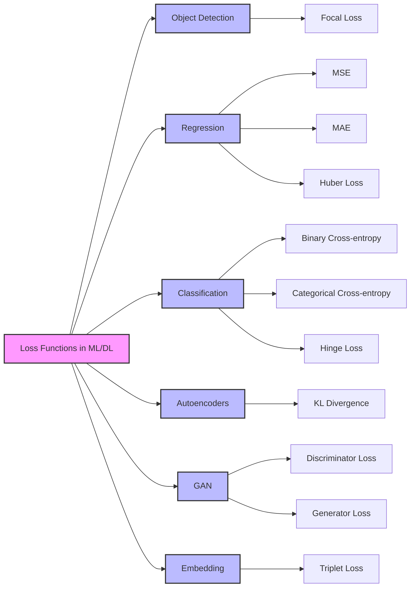

# Loss Functions in Machine Learning and Deep Learning
 
 Understanding Loss Functions in Machine Learning and Deep Learning

## Introduction

Loss functions are fundamental components in machine learning that measure how well a model performs by quantifying the difference between predicted and actual outputs. They serve as the compass that guides the learning process, enabling models to improve their predictions through optimization.

## Key Concepts

### Loss vs. Cost Functions

- **Loss Function**: Measures the error for a single training example, calculating the discrepancy between the model's prediction and the actual target value.
  
- **Cost Function**: Represents the average of loss functions across the entire training dataset, providing an overall measure of model performance.

### Role in Deep Learning

Loss functions are integral to neural network training:
1. Process input data with weights and biases
2. Generate predictions through activation functions
3. Calculate prediction error using the loss function
4. Adjust model parameters to minimize loss
5. Iterate through multiple epochs for optimization

The effectiveness of a machine learning model largely depends on choosing the appropriate loss function for the specific problem and data characteristics. This choice influences how the model learns and adapts to achieve optimal performance.

## Loss Functions in Deep Learning - Classification Table

| Category | Loss Function | Description | Common Use Cases |
|----------|---------------|-------------|------------------|
| **Regression** | MSE (Mean Squared Error) | Measures average squared difference between predicted and actual values | • Continuous value prediction • General regression tasks |
| | MAE (Mean Absolute Error) | Measures average absolute difference between predicted and actual values | • Regression with outliers • Financial predictions |
| | Huber Loss | Combines MSE for small errors and MAE for large errors | • Robust regression • Outlier-sensitive tasks |
| **Classification** | Binary Cross-Entropy | Measures dissimilarity between predicted probability and true label | • Binary classification • Yes/no predictions |
| | Categorical Cross-Entropy | Measures dissimilarity between predicted probability distribution and true one-hot encoded label | • Multi-class classification • Multiple category prediction |
| | Hinge Loss | Encourages correct classifications with large margins | • Support Vector Machines • Margin-based classification |
| **Object Detection** | Focal Loss | Modified cross-entropy that focuses on hard examples | • Object detection • Imbalanced datasets |
| **Autoencoders** | Reconstruction Loss | Measures difference between input and reconstructed output | • Image reconstruction • Data compression |
| | KL Divergence | Measures difference between latent distribution and prior distribution | • Variational autoencoders • Distribution matching |
| **GANs** | Discriminative Loss | Measures discriminator's ability to distinguish real/fake samples | • GAN training • Adversarial networks |
| | Generative Loss | Measures generator's ability to produce realistic samples | • GAN training • Image generation |
| **Embedding** | Triplet Loss | Measures distance between positive and negative pairs | • Face recognition • Similarity learning |

## Different Kinds of Loss function used in Deep Learning

## Other examples of loss function

**Dice Similarity Coefficient:** Used in image segmentation, measures the overlap between the predicted and ground truth masks.

---
**NOTES**

- The sketch you provided did not explicitly mention all of the loss functions listed above. I have included them for a more comprehensive overview.

- The specific loss function used depends on the task, architecture, and dataset.

- There are many other loss functions not listed here, and the field of loss function research is continually evolving.

---

I hope this conceptual map is helpful!

## References:
- [Demystifying Loss Functions in Deep Learning: Understanding the Key Metrics for Model Optimization](https://medium.com/@amanatulla1606/demystifying-loss-functions-in-deep-learning-understanding-the-key-metrics-for-model-optimization-a81ce65e7315)
- [Understanding Mean Absolute Error (MAE) in Regression: A Practical Guide](https://medium.com/@m.waqar.ahmed/understanding-mean-absolute-error-mae-in-regression-a-practical-guide-26e80ebb97df)
  
